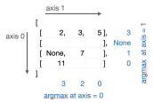

---
jupytext:
  text_representation:
    extension: .md
    format_name: myst
    format_version: 0.13
    jupytext_version: 1.10.3
kernelspec:
  display_name: Python 3
  language: python
  name: python3
---

How to use argmin and argmax
============================

```{code-cell} ipython3
import awkward as ak
```

The arguments of the maxima - `argmax`, and the arguments of the minima - `argmin` are the index positions of the [ak.Array](https://awkward-array.readthedocs.io/en/latest/_auto/ak.Array.html) maximum or minimum elements over an axis.

These functions are [reducers](how-to-math-reducers). By default, the number of dimentions is reduced by 1.

By default, reducing over empty lists results in `None`.

By default, the axis is `None`. In this case the function returns a scalar that is calculated over all the elements in the [ak.Array](https://awkward-array.readthedocs.io/en/latest/_auto/ak.Array.html) as if it is a flat list.

Argmin
------

[ak.argmin](https://awkward-array.readthedocs.io/en/latest/_auto/ak.argmin.html) returns the index position of the minimum value of the [ak.Array](https://awkward-array.readthedocs.io/en/latest/_auto/ak.Array.html) elements over a given axis.

[](img/argmin.svg)

```{code-cell} ipython3
ak.argmin(array = ak.Array([[2, 3, 5], [], [None, 7], [11]]), axis=0)
```

```{code-cell} ipython3
ak.argmin(array = ak.Array([[2, 3, 5], [], [None, 7], [11]]), axis=1)
```

```{code-cell} ipython3
ak.argmin(array = ak.Array([[2, 3, 5], [], [None, 7], [11]]))
```

Argmax
------

[ak.argmax](https://awkward-array.readthedocs.io/en/latest/_auto/ak.argmax.html) returns the index position of the maximum value of the [ak.Array](https://awkward-array.readthedocs.io/en/latest/_auto/ak.Array.html) elements over a given axis.

[](img/argmax.svg)

```{code-cell} ipython3
ak.argmax(array = ak.Array([[2, 3, 5], [], [None, 7], [11]]), axis=0)
```

```{code-cell} ipython3
ak.argmax(array = ak.Array([[2, 3, 5], [], [None, 7], [11]]), axis=1)
```

```{code-cell} ipython3
ak.argmax(array = ak.Array([[2, 3, 5], [], [None, 7], [11]]))
```
