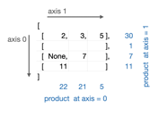
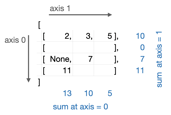
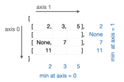
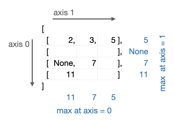
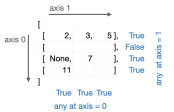
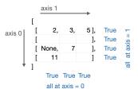
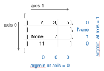
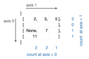

---
jupytext:
  text_representation:
    extension: .md
    format_name: myst
    format_version: 0.13
    jupytext_version: 1.10.3
kernelspec:
  display_name: Python 3
  language: python
  name: python3
---

How to reduce dimensions (sum/min/any/all)
==========================================

```{code-cell} ipython3
import awkward as ak
```

A reducer function is a function that operates on an [ak.Array](https://awkward-array.readthedocs.io/en/latest/_auto/ak.Array.html) reducing its dimentions in a given axis by applying the function to the [ak.Array](https://awkward-array.readthedocs.io/en/latest/_auto/ak.Array.html) elements along this axis. By default `axis=None`. In this case the reducer function returns a scalar that is calculated over all the elements in the [ak.Array](https://awkward-array.readthedocs.io/en/latest/_auto/ak.Array.html).

Product reducer
---------------

[ak.prod](https://awkward-array.readthedocs.io/en/latest/_auto/ak.prod.html) returns the product of the [ak.Array](https://awkward-array.readthedocs.io/en/latest/_auto/ak.Array.html) elements over a given axis.

[](img/product.svg)

```{code-cell} ipython3
ak.prod(array = ak.Array([[2, 3, 5], [], [None, 7], [11]]), axis=0)
```

```{code-cell} ipython3
ak.prod(array = ak.Array([[2, 3, 5], [], [None, 7], [11]]), axis=1)
```

By default `axis=None`. In this case the product of all the elements in the [ak.Array](https://awkward-array.readthedocs.io/en/latest/_auto/ak.Array.html) will be calculated:

```{code-cell} ipython3
ak.prod(array = ak.Array([[2, 3, 5], [], [None, 7], [11]]))
```

Sum reducer
-----------

[ak.sum](https://awkward-array.readthedocs.io/en/latest/_auto/ak.sum.html) returns the sum of the [ak.Array](https://awkward-array.readthedocs.io/en/latest/_auto/ak.Array.html) elements over a given axis.

This operation is similar to NumPy's [sum](https://docs.scipy.org/doc/numpy/reference/generated/numpy.sum.html).

[](img/sum.svg)

```{code-cell} ipython3
ak.sum(array = ak.Array([[2, 3, 5], [], [None, 7], [11]]), axis=0)
```

```{code-cell} ipython3
ak.sum(array = ak.Array([[2, 3, 5], [], [None, 7], [11]]), axis=1)
```

```{code-cell} ipython3
ak.sum(array = ak.Array([[2, 3, 5], [], [None, 7], [11]]))
```

Min reducer
-----------

[ak.min](https://awkward-array.readthedocs.io/en/latest/_auto/ak.min.html) returns the minimum value of the [ak.Array](https://awkward-array.readthedocs.io/en/latest/_auto/ak.Array.html) elements over a given axis.

By default, the minimum of an empty list is `None`.

This operation is similar to NumPy's [amin](https://docs.scipy.org/doc/numpy/reference/generated/numpy.amin.html)

[](img/min.svg)

```{code-cell} ipython3
ak.min(array = ak.Array([[2, 3, 5], [], [None, 7], [11]]), axis=0)
```

```{code-cell} ipython3
ak.min(array = ak.Array([[2, 3, 5], [], [None, 7], [11]]), axis=1)
```

```{code-cell} ipython3
ak.min(array = ak.Array([[2, 3, 5], [], [None, 7], [11]]))
```

Max reducer
-----------

[ak.max](https://awkward-array.readthedocs.io/en/latest/_auto/ak.max.html) returns the maximum value of the [ak.Array](https://awkward-array.readthedocs.io/en/latest/_auto/ak.Array.html) elements over a given axis.

By default, the maximum of an empty list is `None`.

[](img/max.svg)

```{code-cell} ipython3
ak.max(array = ak.Array([[2, 3, 5], [], [None, 7], [11]]), axis=0)
```

```{code-cell} ipython3
ak.max(array = ak.Array([[2, 3, 5], [], [None, 7], [11]]), axis=1)
```

```{code-cell} ipython3
ak.max(array = ak.Array([[2, 3, 5], [], [None, 7], [11]]))
```

Any reducer - “logical or”
--------------------------

[ak.any](https://awkward-array.readthedocs.io/en/latest/_auto/ak.any.html) returns “logical or” of the [ak.Array](https://awkward-array.readthedocs.io/en/latest/_auto/ak.Array.html) elements over a given axis.

This operation is similar to NumPy's [any](https://docs.scipy.org/doc/numpy/reference/generated/numpy.any.html).

[](img/any.svg)

```{code-cell} ipython3
ak.any(array = ak.Array([[2, 3, 5], [], [None, 7], [11]]), axis=0)
```

```{code-cell} ipython3
ak.any(array = ak.Array([[2, 3, 5], [], [None, 7], [11]]), axis=1)
```

```{code-cell} ipython3
ak.any(array = ak.Array([[2, 3, 5], [], [None, 7], [11]]))
```

All reducer - “logical and”
---------------------------

[ak.all](https://awkward-array.readthedocs.io/en/latest/_auto/ak.all.html) tests whether all [ak.Array](https://awkward-array.readthedocs.io/en/latest/_auto/ak.Array.html) elements along a given axis evaluate to `True`, e.g. it returns a “logical and” of the [ak.Array](https://awkward-array.readthedocs.io/en/latest/_auto/ak.Array.html) elements over a given axis.

It returns `True` for an empty list.

It is similar to NumPy's [all](https://docs.scipy.org/doc/numpy/reference/generated/numpy.all.html).

[](img/all.svg)

```{code-cell} ipython3
ak.all(array = ak.Array([[2, 3, 5], [], [None, 7], [11]]), axis=0)
```

```{code-cell} ipython3
ak.all(array = ak.Array([[2, 3, 5], [], [None, 7], [11]]), axis=1)
```

```{code-cell} ipython3
ak.all(array = ak.Array([[2, 3, 5], [], [None, 7], [11]]))
```

Argmin
------

[ak.argmin](https://awkward-array.readthedocs.io/en/latest/_auto/ak.argmin.html) returns the index position of the minimum value of the [ak.Array](https://awkward-array.readthedocs.io/en/latest/_auto/ak.Array.html) elements over a given axis.

[](img/argmin.svg)

```{code-cell} ipython3
ak.argmin(array = ak.Array([[2, 3, 5], [], [None, 7], [11]]), axis=0)
```

```{code-cell} ipython3
ak.argmin(array = ak.Array([[2, 3, 5], [], [None, 7], [11]]), axis=1)
```

```{code-cell} ipython3
ak.argmin(array = ak.Array([[2, 3, 5], [], [None, 7], [11]]))
```

Argmax
------

[ak.argmax](https://awkward-array.readthedocs.io/en/latest/_auto/ak.argmax.html) returns the index position of the maximum value of the [ak.Array](https://awkward-array.readthedocs.io/en/latest/_auto/ak.Array.html) elements over a given axis.

[](img/argmax.svg)

```{code-cell} ipython3
ak.argmax(array = ak.Array([[2, 3, 5], [], [None, 7], [11]]), axis=0)
```

```{code-cell} ipython3
ak.argmax(array = ak.Array([[2, 3, 5], [], [None, 7], [11]]), axis=1)
```

```{code-cell} ipython3
ak.argmax(array = ak.Array([[2, 3, 5], [], [None, 7], [11]]))
```

Count
-----

[ak.count](https://awkward-array.readthedocs.io/en/latest/_auto/ak.count.html) counts the [ak.Array](https://awkward-array.readthedocs.io/en/latest/_auto/ak.Array.html) elements over a given axis.

[](img/count.svg)

```{code-cell} ipython3
ak.count(array = ak.Array([[2, 3, 5], [], [None, 7], [11]]), axis=0)
```

```{code-cell} ipython3
ak.count(array = ak.Array([[2, 3, 5], [], [None, 7], [11]]), axis=1)
```

```{code-cell} ipython3
ak.count(array = ak.Array([[2, 3, 5], [], [None, 7], [11]]))
```

Count non zero
--------------

[ak.count_nonzero](https://awkward-array.readthedocs.io/en/latest/_auto/ak.count_nonzero.html) counts the number of non-zero values of the [ak.Array](https://awkward-array.readthedocs.io/en/latest/_auto/ak.Array.html) elements over a given axis.

This operation is similar to NumPy's [count_nonzero](https://docs.scipy.org/doc/numpy/reference/generated/numpy.count_nonzero.html).

[](img/count_nonzero.svg)

```{code-cell} ipython3
ak.count_nonzero(array = ak.Array([[2, 3, 5], [], [None, 7], [11]]), axis=0)
```

```{code-cell} ipython3
ak.count_nonzero(array = ak.Array([[2, 3, 5], [], [None, 7], [11]]), axis=1)
```

```{code-cell} ipython3
ak.count_nonzero(array = ak.Array([[2, 3, 5], [], [None, 7], [11]]))
```

Range of values (maximum - minimum)
-----------------------------------

Range of values (maximum - minimum) along an axis.

[ak.ptp](https://awkward-array.readthedocs.io/en/latest/_auto/ak.ptp.html) returns the range of values in each group of elements from the [ak.Array](https://awkward-array.readthedocs.io/en/latest/_auto/ak.Array.html). By default the range of an empty list is `None`, unless `mask_identity=False`, in which case it is 0.

This operation is similar to NumPy's [ptp](https://docs.scipy.org/doc/numpy/reference/generated/numpy.ptp.html)

```{code-cell} ipython3
array = ak.Array([[0, 1, 2, 3],
                  [          ],
                  [4, 5      ]])
ak.ptp(array)
```
